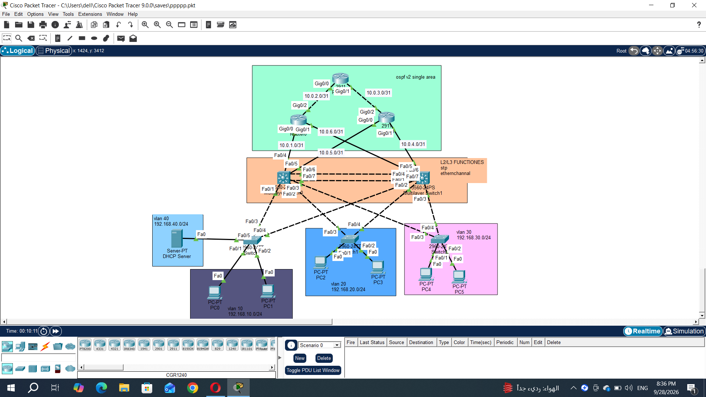

# Enterprise Campus Network

Cisco Packet Tracer enterprise campus network designed to demonstrate
Layer 2 redundancy, VLAN segmentation, EtherChannel, and dynamic routing.

## Technologies

- VLANs
- Rapid PVST+
- STP Root Bridge
- PortFast
- BPDU Guard
- EtherChannel
- Inter-VLAN Routing
- OSPF
- DHCP
- Multilayer Switching

## VLANs

| VLAN | Network |
|------|---------|
| 10 | 192.168.10.0/24 |
| 20 | 192.168.20.0/24 |
| 30 | 192.168.30.0/24 |
| 40 | 192.168.40.0/24 |

## STP Design

Rapid PVST+ is used to provide Layer 2 redundancy.

- Multilayer Switch 0 is the Root Bridge for VLANs 10 and 30.
- Multilayer Switch 1 is the Root Bridge for VLAN 20.
- Access switches use PortFast and BPDU Guard on end-device ports.

## EtherChannel

EtherChannel is configured between the multilayer switches to provide
link redundancy and increased bandwidth.

## Routing

OSPF is used as the dynamic routing protocol between the Layer 3 devices.

## DHCP

A dedicated DHCP server provides IP addressing for the VLANs.

## Topology

The network topology is shown below:

## Packet Tracer Project

The complete Cisco Packet Tracer project file is included in this repository.
